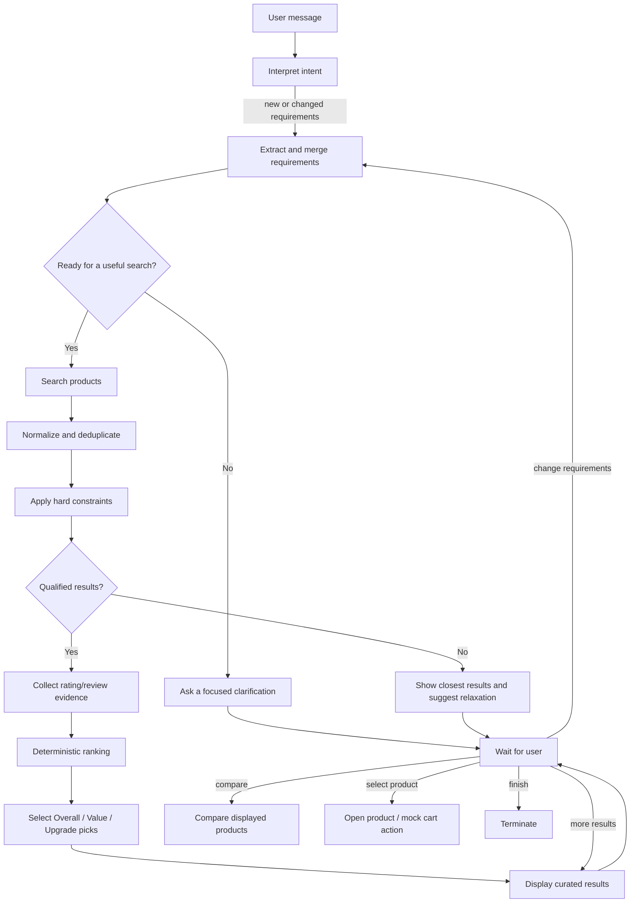
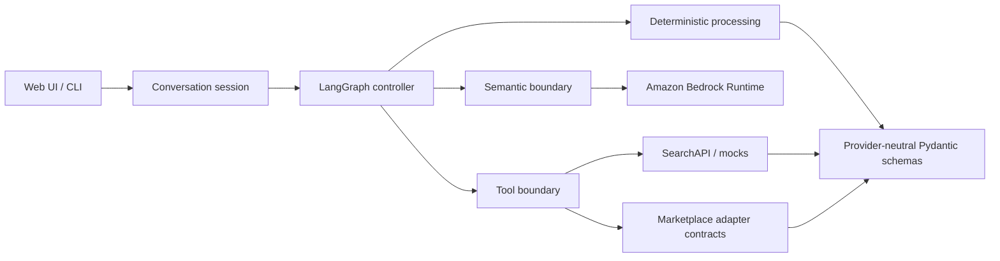

# MindMuse — Agentic AI Shopping Assistant

> A stateful, explainable shopping agent that turns an open-ended request into a structured product decision.

[Project Presentation](https://canva.link/d064g566q14ni1j) · [Architecture Notes](docs/architecture.md) · [State Model](docs/state.md)

MindMuse is the project name; **Muse** is the shopper-facing assistant. Muse does more than generate a one-off answer: it maintains shopping context, identifies missing information, chooses the next operation, searches live product data, applies hard constraints, ranks qualified products, and supports follow-up actions such as comparison, pagination, and product selection.

The project combines **LangGraph**, **Amazon Bedrock**, **SearchAPI**, and deterministic Python decision logic. A browser interface and a command-line interface are both included.

## Motivation

Online shopping creates a decision problem, not just a search problem.

A shopper may begin with an incomplete request such as “I need running shoes” while the details that determine a useful result—size, budget, compatibility, delivery deadline, or a must-have feature—remain unstated. Traditional search engines return large result sets, and conventional chatbots may recommend products without consistently enforcing constraints or preserving context across follow-up turns.

MindMuse is designed around four needs:

1. **Reduce choice overload.** Convert a broad request into a small set of decision-ready recommendations.
2. **Ask only useful questions.** Distinguish required information from optional preferences according to the product category.
3. **Make recommendations auditable.** Keep factual filtering and ranking in transparent Python logic instead of asking an LLM to invent or silently enforce product facts.
4. **Support a complete decision journey.** Preserve state across clarification, search, comparison, requirement changes, pagination, and purchase handoff.

## Solution

Muse treats shopping as a stateful, tool-using workflow:

- An Amazon Bedrock-hosted LLM classifies each user turn and converts natural language into typed shopping requirements.
- A LangGraph controller inspects the shared state after every operation and decides what should happen next.
- SearchAPI supplies live Google Shopping results and optional public community/forum sources.
- Deterministic processing removes duplicates, enforces hard constraints, and calculates a transparent ranking.
- A recommendation layer can surface **Best Overall**, **Best Value**, and **Best Upgrade** options when each tier has a justified candidate.
- The interface keeps the shopper in control and hands any real purchase off to the original marketplace page.

This hybrid approach uses the LLM where semantic understanding is valuable and ordinary code where consistency, traceability, and safety matter most.

## Key Highlights

### A genuinely agentic control loop

The workflow is not a fixed prompt chain. The router re-evaluates the complete structured state after every node. Depending on what it observes, it can clarify, search, enrich evidence, rank, show another page, compare products, handle a changed requirement, open a selected product, or terminate.

### Category-aware requirement discovery

Muse identifies the minimum information needed for the current category. Shoe size may be required for footwear, while interface and capacity may matter for an SSD. Optional preferences such as colour or brand do not block search unless the request makes them essential. Explicit answers such as “any brand” or “no preference” are recorded so the agent does not ask the same question again.

### LLM understanding with deterministic guardrails

The LLM interprets intent, extracts a requirement patch, and writes concise clarification questions. It does **not** decide whether a product violates a known price, stock, arrival, size, attribute, or must-have constraint. Those checks are performed by testable Python functions.

### Explainable, decision-oriented recommendations

Products are ranked using observable signals such as rating, review count, budget headroom, preferred platform, delivery priority, and available review evidence. Muse then creates distinct recommendation tiers when the result set contains a justified candidate for each:

- **Best Overall** — strongest fit across requirements, preferences, quality, and budget.
- **Best Value** — a lower-cost option that preserves a strong combination of match and quality.
- **Best Upgrade** — a more expensive option only when it provides a meaningful quality or evidence improvement and stays within a controlled ceiling.

The system never pads the list with a fabricated upgrade when no meaningful upgrade exists.

### Evidence-aware product discovery

The real-data mode normalizes Google Shopping results into provider-neutral product objects. Marketplace rating evidence feeds the ranking, while the Web UI can fetch public community and forum sources asynchronously so optional enrichment does not delay the core recommendation flow.

### Stateful follow-up interaction

Requirements, prior turns, ranked products, displayed products, and lifecycle statuses are retained in `ShoppingState`. This lets Muse understand follow-ups such as:

- “Make the budget $120.”
- “Show me more.”
- “Compare the first and third options.”
- “I want the second one.”
- “Any brand is fine.”

Positional references are resolved against the products the shopper actually saw, rather than the provider’s hidden raw ordering.

### Pluggable commerce boundaries

Search, review retrieval, cart/action handling, and language semantics are injected services. Mock implementations support repeatable development and tests, while provider-neutral schemas isolate the graph from external API response formats.

## Workflow



Every turn starts with `interpret_user_input`. After each node, the pure `next_action` router selects exactly one next operation from lifecycle fields such as `requirement_status`, `search_required`, `review_status`, `ranking_status`, `presentation_status`, and `purchase_status`.

### Core graph nodes

| Node | Responsibility |
| --- | --- |
| `interpret_user_input` | Classify the latest turn and resolve search, change, more, compare, purchase, or finish intent. |
| `extract_requirements` | Convert the message into a typed requirement patch and assess search readiness. |
| `ask_clarification` | Ask only for missing required information or suggest relaxing an unsuccessful search. |
| `search_products` | Call the configured product source, deduplicate results, and enforce hard constraints. |
| `fetch_reviews` | Attach available marketplace rating/review evidence without fabricating missing evidence. |
| `rank_products` | Score qualified products with deterministic, inspectable logic. |
| `select_best_picks` | Produce a Best Overall pick plus justified Value and Upgrade recommendations. |
| `display_results` | Present a page of ranked results and wait for the next user decision. |
| `compare_products` | Compare products from the currently displayed result set. |
| `add_to_cart` | Use a mock cart in mock mode or return the real product link in SearchAPI mode. |
| `terminate` | Close the shopping session. |

## Architecture



| Layer | Purpose |
| --- | --- |
| `agent/` | Shared state, graph construction, routing, prompts, and state-transition nodes. |
| `llm/` | Amazon Bedrock access and the natural-language-to-structured-state boundary. |
| `processing/` | Deduplication, hard-constraint filtering, and transparent scoring. |
| `schemas/` | Typed contracts for requirements, products, reviews, community evidence, and best picks. |
| `tools/` | Stable tool protocols and local mock implementations. |
| `tools_real/` | SearchAPI integration and real-operation orchestration. |
| `platforms/` | Provider adapter interface and marketplace-specific integration templates. |
| `ui/` | In-memory Web sessions, JSON endpoints, and the zero-framework browser interface. |

## Getting Started

The recommended setup uses [`uv`](https://docs.astral.sh/uv/). It installs a compatible Python version, creates `.venv`, and installs the locked dependencies, so a separate system-wide Python installation is not required.

You will need:

- Git, or a downloaded ZIP of this repository;
- an AWS account with Amazon Bedrock access;
- one AWS credential method described below;
- a Converse-compatible Bedrock model;
- a [SearchAPI](https://www.searchapi.io/) key for live product search. SearchAPI is not required in mock commerce mode.

### Windows 10/11 — complete PowerShell setup

Run the following commands in **PowerShell**, not inside the Python interpreter.

#### 1. Install Git and uv

Windows Package Manager (`winget`) is the simplest option:

```powershell
winget install --id Git.Git -e --source winget
winget install --id astral-sh.uv -e
```

Close PowerShell, open a new PowerShell window, and verify both commands:

```powershell
git --version
uv --version
```

If `winget` is unavailable, install [Git for Windows](https://git-scm.com/install/windows) manually and install uv with its official PowerShell installer:

```powershell
powershell -ExecutionPolicy ByPass -c "irm https://astral.sh/uv/install.ps1 | iex"
```

Open a new PowerShell window after installation so the updated `PATH` is loaded.

#### 2. Download the project

Choose a directory in which to keep the project, then clone the verified repository URL:

```powershell
Set-Location "$HOME\Documents"
git clone https://github.com/jianyilu13-art/MindMuse_AI_agent_Hackathon2026.git
Set-Location ".\MindMuse_AI_agent_Hackathon2026"
```

If you already cloned the repository, do not clone it again. Enter the existing directory and update it instead:

```powershell
Set-Location "C:\path\to\MindMuse_AI_agent_Hackathon2026"
git pull
```

Without Git, download the [main branch ZIP](https://github.com/jianyilu13-art/MindMuse_AI_agent_Hackathon2026/archive/refs/heads/main.zip), select **Extract All** in File Explorer, and enter the extracted directory:

```powershell
Set-Location "C:\path\to\MindMuse_AI_agent_Hackathon2026-main"
```

All remaining commands must be run from the directory containing `pyproject.toml`. Confirm that you are in the correct place:

```powershell
Test-Path .\pyproject.toml
```

The command must print `True`.

#### 3. Install Python 3.12 and project dependencies

```powershell
uv python install 3.12
uv sync --python 3.12
uv run python --version
```

The last command should print `Python 3.12.x`. `uv sync` creates or updates `.venv` automatically; do not run `pip install` and do not activate `.venv` when following this path.

#### 4. Obtain the required API credentials

##### Amazon Bedrock

For local development, the shortest setup is a Bedrock API key:

1. Sign in to the [Amazon Bedrock console](https://console.aws.amazon.com/bedrock/).
2. Select the `us-east-1` Region in the AWS console.
3. Open the model catalog or Chat/Text playground and confirm that **Amazon Nova Lite** can be selected.
4. Open **API keys**, generate a key, and copy it immediately. AWS only displays the complete key once.

The example configuration uses model ID `amazon.nova-lite-v1:0` in `us-east-1`. If you select another model or Region, copy its exact model or inference-profile ID and update both values together. The selected model must support the Bedrock Converse API.

For an IAM user, AWS profile, or IAM role instead of a Bedrock API key, the principal needs at least `bedrock:InvokeModel` permission for the selected model. Boto3 automatically uses the standard AWS credential chain.

##### SearchAPI

Create an account at [SearchAPI](https://www.searchapi.io/), open its dashboard, and copy the API key. This key is used for Google Shopping results and optional community/forum searches; it is separate from the AWS credential.

#### 5. Create and edit `.env`

Create the private configuration file from the tracked example, then open it in Notepad:

```powershell
Copy-Item .env.example .env
notepad .env
```

For the Bedrock API-key path and live shopping search, make `.env` look like this and replace both placeholder secrets:

```dotenv
AWS_BEARER_TOKEN_BEDROCK=replace_with_your_bedrock_api_key
AWS_REGION=us-east-1
BEDROCK_MODEL_ID=amazon.nova-lite-v1:0

SEARCHAPI_API_KEY=replace_with_your_searchapi_key
SEARCHAPI_GL=sg
SEARCHAPI_HL=en
SHOPPING_TOOL_MODE=searchapi
SEARCHAPI_MAX_PRODUCTS=12
SEARCHAPI_FORUM_TOP_K=1
```

Do not add quotes around the keys. Save the file as `.env`, not `.env.txt`. `.env` is ignored by Git and must never be committed. If upgrading from the earlier Groq version, remove `GROQ_API_KEY` and `GROQ_MODEL`; they are no longer read by the application.

For a configured AWS profile instead of a Bedrock API key, omit `AWS_BEARER_TOKEN_BEDROCK` and use:

```dotenv
AWS_PROFILE=your_profile_name
AWS_REGION=us-east-1
BEDROCK_MODEL_ID=amazon.nova-lite-v1:0
```

You may create the local profile with the AWS CLI by running `aws configure --profile your_profile_name`. On EC2, ECS, or Lambda, prefer an attached IAM role and omit all AWS access keys from `.env`.

#### 6. Verify the installation

The automated tests do not call AWS or SearchAPI and therefore do not spend API credits:

```powershell
uv run pytest
```

All tests should pass before starting the application.

#### 7. Start the Web application

```powershell
uv run python -m shopping_agent.ui
```

Wait until PowerShell prints:

```text
Shopping UI running at http://127.0.0.1:8000
```

Open [http://127.0.0.1:8000](http://127.0.0.1:8000) in a browser. Keep the PowerShell window open while using the application. Press `Ctrl+C` in that window to stop the server.

The first chat message triggers the first real Bedrock request. A product search additionally triggers SearchAPI when `SHOPPING_TOOL_MODE=searchapi`.

#### 8. Run the command-line interface instead

Stop the Web server first, or open another PowerShell window in the project directory:

```powershell
uv run python -m shopping_agent.main
```

Type `exit` or `quit` to end the CLI session.

### macOS and Linux — quick setup

Install Git with your operating system package manager, then run:

```bash
curl -LsSf https://astral.sh/uv/install.sh | sh
git clone https://github.com/jianyilu13-art/MindMuse_AI_agent_Hackathon2026.git
cd MindMuse_AI_agent_Hackathon2026
uv python install 3.12
uv sync --python 3.12
cp .env.example .env
```

Edit `.env` using the same values shown in the Windows section, then verify and start the application:

```bash
uv run pytest
uv run python -m shopping_agent.ui
```

Open [http://127.0.0.1:8000](http://127.0.0.1:8000) and use `Ctrl+C` to stop the server.

### Standard `pip` alternative

Use this path only if Python 3.10 or newer is already installed and you do not want to use uv.

On Windows PowerShell:

```powershell
py -3.12 -m venv .venv
Set-ExecutionPolicy -Scope Process -ExecutionPolicy Bypass
.\.venv\Scripts\Activate.ps1
python -m pip install --upgrade pip
python -m pip install -e ".[test]"
python -m pytest
python -m shopping_agent.ui
```

On macOS or Linux:

```bash
python3 -m venv .venv
source .venv/bin/activate
python -m pip install --upgrade pip
python -m pip install -e ".[test]"
python -m pytest
python -m shopping_agent.ui
```

### Setup troubleshooting

| Symptom | Resolution |
| --- | --- |
| `git` or `uv` is not recognized on Windows | Close and reopen PowerShell after installation, then run `git --version` and `uv --version`. |
| `pyproject.toml` cannot be found | Use `Set-Location` to enter the cloned or extracted project directory before running `uv sync`. |
| `NoCredentialsError` or “Unable to locate credentials” | Set a valid `AWS_BEARER_TOKEN_BEDROCK`, configure `AWS_PROFILE`, or attach an IAM role. Check that the API key has not expired. |
| Bedrock returns `AccessDeniedException` | Grant `bedrock:InvokeModel` and confirm that the selected model is available to the AWS account. |
| Bedrock returns a validation/resource error | Verify that `AWS_REGION` and `BEDROCK_MODEL_ID` refer to the same available, Converse-compatible model or inference profile. |
| `SEARCHAPI_API_KEY is missing` | Add the SearchAPI key for live search, or use `SHOPPING_TOOL_MODE=mock`. |
| The Web page does not open | Keep the server terminal running and open exactly `http://127.0.0.1:8000`. |

## Run with Local Mock Commerce Tools

Mock mode keeps real Bedrock-based intent and requirement understanding, but replaces product search, review retrieval, and cart behavior with local deterministic data. Bedrock credentials, a Region, and a model ID are still required for an interactive session; a SearchAPI key is not.

Set this in `.env`:

```dotenv
SHOPPING_TOOL_MODE=mock
AWS_BEARER_TOKEN_BEDROCK=your_bedrock_api_key
AWS_REGION=us-east-1
BEDROCK_MODEL_ID=amazon.nova-lite-v1:0
```

Then start either interface using the same commands above.

## Example Conversation

```text
You: I need running shoes.
Muse: What shoe size do you need? You can also share a budget, or say any budget.

You: EU 42, under $100, any brand.
Muse: [searches, filters, ranks, and presents the strongest matches]

You: Compare the first and third options.
Muse: [compares the currently displayed products]

You: Show me more.
Muse: [shows the next result page without repeating the search]

You: Increase my budget to $120.
Muse: [updates the requirement state and runs a new search]

You: I want the second one.
Muse: [opens the seller link in live mode or uses the mock cart in mock mode]
```

Exact wording varies because intent parsing and clarification generation use the configured LLM.

## Configuration Reference

| Variable | Required | Default | Description |
| --- | --- | --- | --- |
| `AWS_BEARER_TOKEN_BEDROCK` | One local credential option | — | Bedrock API key for local development. The AWS console currently issues these keys with an expiration. |
| `AWS_ACCESS_KEY_ID` / `AWS_SECRET_ACCESS_KEY` | Alternative credential option | — | Standard AWS credentials. Prefer temporary credentials or a role over long-lived credentials. |
| `AWS_SESSION_TOKEN` | Temporary credentials only | — | Session token accompanying temporary AWS access keys. |
| `AWS_PROFILE` | No | AWS SDK default | Name of a locally configured AWS profile. |
| `AWS_REGION` | Interactive runtime | — | Region used to create the `bedrock-runtime` client. `AWS_DEFAULT_REGION` is also accepted. |
| `BEDROCK_MODEL_ID` | Interactive runtime | — | Converse-compatible foundation model or inference profile ID. |
| `SHOPPING_TOOL_MODE` | No | `searchapi` | `searchapi`/`real` for live aggregated search, or `mock` for local commerce data. |
| `SEARCHAPI_API_KEY` | Live search | — | Authenticates SearchAPI requests. |
| `SEARCHAPI_GL` | No | `sg` | Search country/region code and fallback currency context. |
| `SEARCHAPI_HL` | No | `en` | Search result language. |
| `SEARCHAPI_MAX_PRODUCTS` | No | `12` | Maximum number of shopping results normalized per search. |
| `SEARCHAPI_FORUM_TOP_K` | No | `1` | Number of top products enriched with forum/community searches. Set `0` to disable. |

## Ranking and Safety Principles

### Hard constraints are enforced before ranking

A product is excluded when available data proves that it violates a stated constraint:

- unavailable or explicitly out of stock;
- below a minimum or above a maximum price;
- later than a required arrival date;
- incompatible with a verified size or named attribute;
- missing a stated must-have term.

Aggregated commerce data is sometimes incomplete. Unknown stock or size metadata is treated as **unverified**, not automatically as a mismatch. The recommendation layer reduces confidence for unverified critical attributes instead of presenting them as confirmed matches.

### LLM output cannot invent product facts

Prompts explicitly prohibit invented prices, availability, delivery dates, review claims, or preferences. Product eligibility and score calculations operate only on normalized provider data and explicit user requirements.

### Purchase remains user-controlled

In SearchAPI mode, selecting a product returns its marketplace or seller URL. Checkout occurs outside MindMuse. The project does not place a real order, store payment details, or perform an autonomous checkout.

## Web API

The included browser application exposes a small local JSON API:

| Method | Path | Purpose |
| --- | --- | --- |
| `GET` | `/` | Serve the Web interface. |
| `GET` | `/api/state` | Return the current session view model. |
| `POST` | `/api/chat` | Process `{"message": "..."}` through the shopping graph. |
| `POST` | `/api/reset` | Reset the current conversation. |

Sessions are identified by a same-site cookie and stored only in process memory. This API is intended for local demonstration and prototyping, not production deployment as-is.

## Testing

The test suite replaces the LLM and external commerce services with deterministic adapters, so it requires no API keys and no network access.

```bash
uv run pytest
```

Or:

```bash
python -m pytest
```

Coverage includes:

- clarification before search;
- requirement updates and no-result recovery;
- the full search → evidence → ranking → display flow;
- pagination without redundant searches;
- product comparison and cart/action routing;
- hard-constraint and unknown-metadata behavior;
- SearchAPI normalization, caching, locale, and community-source parsing;
- Best Overall, Best Value, and Best Upgrade selection rules;
- provider registry and dependency-injection boundaries.

## Project Structure

```text
.
├── docs/
│   ├── architecture.md
│   ├── api.md
│   └── state.md
├── src/shopping_agent/
│   ├── agent/          # LangGraph, router, nodes, prompts, shared state
│   ├── llm/            # Amazon Bedrock client and structured semantic parsing
│   ├── platforms/      # Marketplace contracts and adapter templates
│   ├── processing/     # Deduplication, filtering, and ranking
│   ├── schemas/        # Provider-neutral Pydantic models
│   ├── tool_mock/      # Local fictional catalogue support
│   ├── tools/          # Tool protocols and stable mocks
│   ├── tools_real/     # SearchAPI and real-operation orchestration
│   ├── ui/             # Browser application and view-model mapping
│   └── main.py         # CLI conversation loop
├── tests/              # Unit and end-to-end graph tests
├── .env.example
├── pyproject.toml
└── uv.lock
```

## Extending MindMuse

### Add a marketplace integration

Implement `ShoppingPlatform` in `src/shopping_agent/platforms/`, map the provider response into the shared `Product` and `Review` schemas, and register the adapter in `platforms.PLATFORMS`. Provider payloads and credentials should remain inside the adapter layer; the agent graph should not require platform-specific conditionals.

The Amazon, eBay, Lazada, and Shopee classes currently define integration templates and intentionally raise `NotImplementedError`. The default live application uses SearchAPI aggregation instead.

### Add a graph capability

1. Add the required observable field or lifecycle status to `ShoppingState`.
2. Implement one focused state-transition method in `ShoppingNodes`.
3. Register the node in `build_shopping_graph`.
4. Add a pure routing condition in `next_action`.
5. Cover the transition with a deterministic test adapter.

This keeps routing visible and prevents business decisions from being hidden inside prompts.

## Current Limitations

- Browser sessions are in memory and disappear when the local server restarts.
- Live product coverage depends on SearchAPI and the underlying Google Shopping result fields.
- SearchAPI mode uses marketplace rating metadata as review evidence; it does not fetch full review bodies from every seller.
- Community enrichment exposes public search sources and snippets, not a verified consensus score.
- Direct Amazon, eBay, Lazada, and Shopee API adapters are scaffolds for future implementation.
- Real checkout, authentication with seller accounts, and payment handling are deliberately out of scope.

## Roadmap

- Persistent sessions and user preference profiles
- Production-ready marketplace adapters
- Richer review retrieval, provenance, and contradiction analysis
- Evaluation datasets for requirement extraction and ranking quality
- Observability for node latency, tool failures, and recommendation outcomes
- Deployment packaging, authentication, and rate limiting for the Web API

---

**MindMuse** aims to make shopping feel less like browsing an endless catalogue and more like working through a decision with a careful, transparent assistant.
